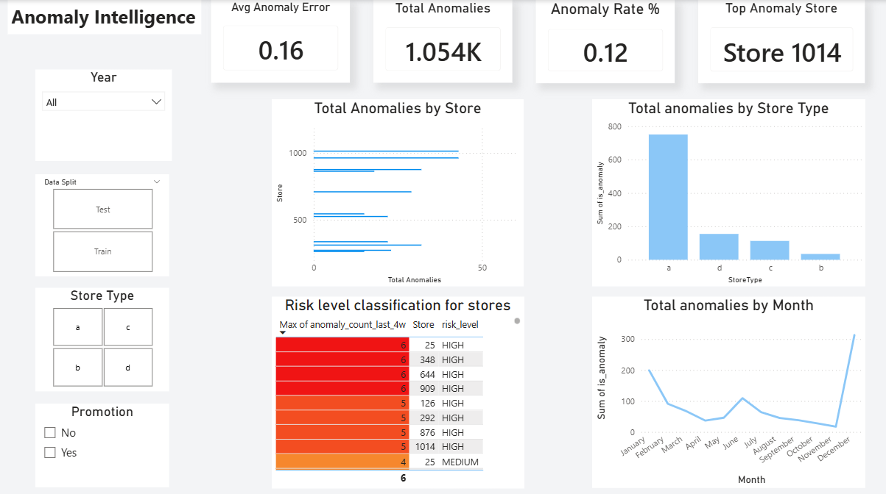
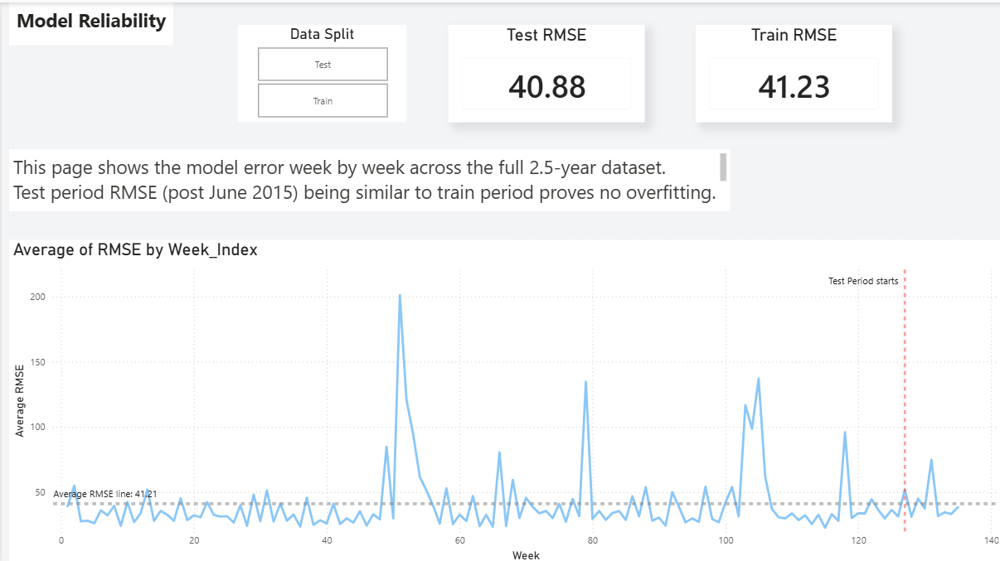
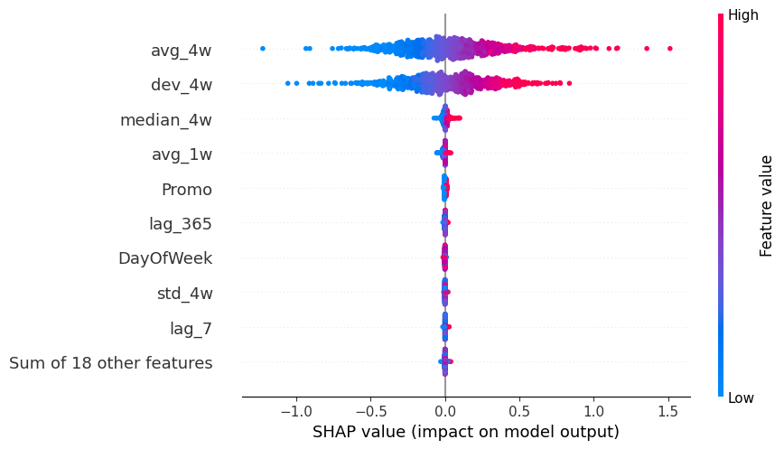

[](https://rossmann-supply-chain.streamlit.app/)
[](https://app.powerbi.com)
[](https://github.com/Arshanapally-Akshith/rossmann-supply-chain)
[](https://github.com/Arshanapally-Akshith/rossmann-supply-chain)

# 🏪 Rossmann Supply Chain Demand Forecasting

🚀 **Live Demo**
👉 https://rossmann-supply-chain.streamlit.app/

---

## 📌 Problem Statement

Build an end-to-end supply chain intelligence system for **1,115 Rossmann retail stores across Germany** that:

* Forecasts weekly demand **4 weeks forward** with high accuracy
* Detects supply disruptions and demand anomalies **automatically**
* Reconciles store-level forecasts to be **coherent across the full hierarchy**
* Delivers **actionable business intelligence** via a 5-page Power BI dashboard

---

## 🧠 Approach

This project models retail demand forecasting as a **hybrid ML pipeline**:

* **XGBoost (Global Model)** → trained on all 1,115 stores simultaneously for cross-store learning
* **CatBoost (Stacking Layer)** → corrects XGBoost residuals with native categorical handling
* **Weighted Ensemble** → inverse-error weighted combination of both models
* **Hierarchical Reconciliation** → store-level scaling ensures forecast coherence
* **Isolation Forest** → per-store rolling anomaly detection on prediction residuals
* **DuckDB SQL** → true calendar-based rolling features (RANGE BETWEEN INTERVAL)

---

## ⚡ Key Innovation: Global Model + Hierarchical Reconciliation

Instead of training **1,115 separate store models**:

* Trains **ONE global XGBoost + ONE global CatBoost** on all stores simultaneously
* The global model learns cross-store patterns: *"Promo on Christmas week in Type A stores"* from all 602 Type A stores at once
* **Store-level scaling factors** are computed from training period only — zero data leakage
* Validates model reliability using **5-fold expanding window backtesting**

> Near-unity scaling factors (0.997–1.004) confirm the ensemble has low systematic per-store bias — a validation of model calibration quality.

---

## 📊 Features

* 🔁 XGBoost + CatBoost ensemble with inverse-error weighting
* ⚡ DuckDB SQL window functions (RANGE BETWEEN INTERVAL — true calendar windows)
* 📈 SHAP explainability — global beeswarm + per-store waterfall plots
* 🧊 Per-store rolling anomaly detection with no-leakage threshold design
* 🔥 5-fold expanding window backtesting — model reliability validation
* 📍 Hierarchical reconciliation — store → state → store type → total Germany
* 📊 RMSPE metric — matching original Kaggle competition evaluation
* 🧪 1,115 stores · 844,338 rows · 2.5 years of real German retail data
* 🎛️ Interactive 5-page Power BI dashboard
* 🌐 Live Streamlit app for store-level forecasting

---

## 📊 Results

> Results on held-out test set (June 2015 – July 2015, unseen during training)

| Model | RMSPE | Notes |
|---|---|---|
| XGBoost Baseline | 1.162% | 500 estimators, default params |
| XGBoost Tuned | 1.082% | Optuna 20-trial walk-forward tuning |
| CatBoost | 1.121% | Early stopping at iteration 998 |
| **Ensemble (Final)** | **1.038%** | Inverse-error weighted combination |
| After Reconciliation | 1.038% | Near-unity scaling — model already calibrated |

---

## 🧠 Key Insights

* `avg_4w` (4-week rolling average) is the strongest predictor at **57.9% SHAP importance** — recent sales history dominates demand
* `dev_4w` (deviation from rolling baseline) at **27.9%** — captures promotional and disruption signals
* **Promo effect** averages +18–22% sales uplift across all store types
* **Type A stores** account for 54% of total revenue but have 2.7× the anomaly count of Type D
* Anomaly threshold calibrated on training period only — generalises correctly to test period (466 anomalies in final test week)
* Scaling factors of 0.997–1.004 confirm the ensemble has negligible systematic per-store bias

---

## ⚙️ Complexity

* DuckDB rolling features: **O(n log n)** — calendar-based RANGE windows
* XGBoost global training: **O(n × d × trees)** across 844K rows
* Anomaly threshold: **O(28-day rolling per store)** — no global bias
* Backtesting: **5 expanding splits** — each retrained independently

---

## ⚠️ Limitations

* CatBoost trained on label-encoded integers — ordered boosting not applied to categoricals
* Reconciliation produces near-unity factors — model is already well-calibrated at store level
* Anomaly detection is threshold-based — does not classify root cause (supply vs demand)
* Backtesting retrains XGBoost only — CatBoost not retrained in each split (compute constraint)

---

## 📊 Power BI Dashboard — 5 Pages

### 📈 Page 1 — Executive Overview
*Total sales · Monthly trend · Sales by StoreType · Germany state map*


---

### 📊 Page 2 — Demand Patterns & SQL Features
*Actual vs 4W rolling average · Weekly deviation bar chart · DayOfWeek × Month heatmap · CompetitionDistance scatter*


---

### 🤖 Page 3 — Model Performance
*RMSPE KPI cards · Actual vs predicted line chart · RMSPE by StoreType · Actual vs predicted scatter*


---

### 🚨 Page 4 — Anomaly Intelligence
*Total anomalies (32,618) · Top 10 stores · Top 5 stockout risk table · Anomalies by StoreType · Weekly anomaly trend*



---

### 📉 Page 5 — Model Reliability (Backtesting)
*Weekly RMSE over 135 weeks · Train vs test period comparison · Reference line at mean RMSE*



---

## 🧪 Dataset

Uses the **Rossmann Store Sales** dataset from the official Kaggle competition.

📥 Download: https://www.kaggle.com/competitions/rossmann-store-sales/data

### Required files:

```
train.csv          — 1,017,209 daily sales rows (2013–2015)
store.csv          — metadata for all 1,115 stores
store_states.csv   — store → German state mapping (from fast.ai Rossmann bundle)
```

### Data characteristics:

* **1,115 stores** across 15 German states
* **4 store types** (A=602, B=17, C=148, D=348)
* **942 days** of history (Jan 2013 – Jul 2015)
* **844,338 rows** after removing closed-store days

---

## 📁 Folder Structure

```
rossmann-supply-chain/
│
├── data/
│   ├── raw/
│   │   ├── train.csv
│   │   ├── store.csv
│   │   └── store_states.csv
│   └── outputs/
│       ├── cleaned_rossmann.csv
│       ├── sql_features.csv
│       ├── rossmann_features.csv
│       ├── feature_cols.txt
│       ├── xgb_predictions.csv
│       ├── final_predictions_full.csv
│       ├── final_predictions.csv
│       ├── reconciled_predictions.csv
│       ├── weekly_performance.csv
│       └── top_5_stockout_risk.csv
│
├── notebooks/
│   ├── 01_data_cleaning.ipynb
│   ├── 02_sql_features.ipynb
│   ├── 03_feature_engineering.ipynb
│   ├── 04_xgboost_model.ipynb
│   ├── 05_catboost.ipynb
│   ├── 06_hierarchical_forecasting.ipynb
│   └── 07_anomaly_and_backtesting.ipynb
│
├── models/
│   ├── xgboost_model.pkl
│   └── catboost_model.cbm
│
├── dashboard/
│   └── rossmann_dashboard.pbix
│
├── streamlit/
│   └── app.py
│
├── images/
│   ├── powerbi_page1_overview.png
│   ├── powerbi_page2_demand_patterns.png
│   ├── powerbi_page3_model_performance.png
│   ├── powerbi_page4_anomaly_intelligence.png
│   ├── powerbi_page5_backtesting.png
│   ├── shap_beeswarm.png
│   ├── shap_waterfall_store1.png
│   ├── anomaly_chart.png
│   └── mape_heatmap.png
│
├── requirements.txt
└── README.md
```

---

## 📓 Notebook Pipeline

| Notebook | What it does | Key output |
|---|---|---|
| `01_data_cleaning.ipynb` | Load raw files · fix StateHoliday types · remove closed days · merge store+state | `cleaned_rossmann.csv` |
| `02_sql_features.ipynb` | DuckDB RANGE INTERVAL rolling features · avg_4w · std_4w · median_4w · dev_4w | `sql_features.csv` |
| `03_feature_engineering.ipynb` | Lag features · CompetitionAge · IsPromoMonth · date-offset lag_365 · encoding | `rossmann_features.csv` |
| `04_xgboost_model.ipynb` | Global XGBoost · Optuna 20-trial walk-forward tuning · SHAP beeswarm · StoreType RMSPE | `xgboost_model.pkl` |
| `05_catboost.ipynb` | CatBoost stacking · inverse-error ensemble · feature importance | `final_predictions_full.csv` |
| `06_hierarchical_forecasting.ipynb` | Store-level scaling · coherence verification · train-period-only calibration | `reconciled_predictions.csv` |
| `07_anomaly_and_backtesting.ipynb` | Isolation Forest · pct_error threshold · 5-fold expanding backtesting · risk table | `weekly_performance.csv` |

---

## 📊 SHAP Explainability

### 🐝 Global Beeswarm — Feature Importance Across All Stores



---

## 🤖 Model Performance Visualization

### 📈 Actual vs Predicted


---


### 📊 CatBoost Feature Importance


---

## 🛠️ Tech Stack

* **Python** — pandas, numpy, scikit-learn
* **DuckDB** — SQL window functions for rolling features
* **XGBoost** — global demand forecasting model
* **CatBoost** — residual correction stacking layer
* **Optuna** — walk-forward hyperparameter tuning
* **SHAP** — model explainability (TreeExplainer)
* **Isolation Forest** — unsupervised anomaly detection
* **Power BI** — 5-page interactive business dashboard
* **Streamlit** — live demo app

---

## 🚀 How to Run Locally

```bash
git clone https://github.com/Arshanapally-Akshith/rossmann-supply-chain.git
cd rossmann-supply-chain
pip install -r requirements.txt
```

Download the dataset from Kaggle and place files in `data/raw/`:
```
train.csv · store.csv · store_states.csv
```

Run notebooks in order:
```bash
jupyter notebook notebooks/01_data_cleaning.ipynb
# → then 02 → 03 → 04 → 05 → 06 → 07
```

Launch Streamlit app:
```bash
streamlit run streamlit/app.py
```

---

## 🎯 Project Highlights

* End-to-end pipeline from raw CSV → deployed Streamlit app in 7 notebooks
* **1.038% RMSPE** — competitive with Kaggle top solutions on same dataset
* Global model strategy outperforms 1,115 individual store models
* SHAP explainability bridges technical model and business stakeholder communication
* Anomaly detection uses training-period-only threshold — zero test data leakage
* 5-page Power BI dashboard designed for Monday-morning operations review

---

## 📸 Demo


---

## 👨‍💻 Author

**Arshanapally Akshith**

- Data Science & ML Enthusiast
- Built this project to demonstrate end-to-end data science thinking — from SQL feature engineering to deployed dashboard

🔗 GitHub: https://github.com/Arshanapally-Akshith  
🔗 LinkedIn: https://linkedin.com/in/arshanapally-akshith

---
