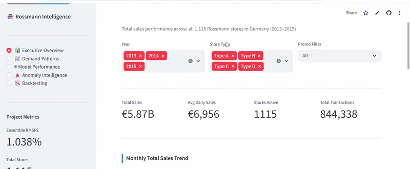
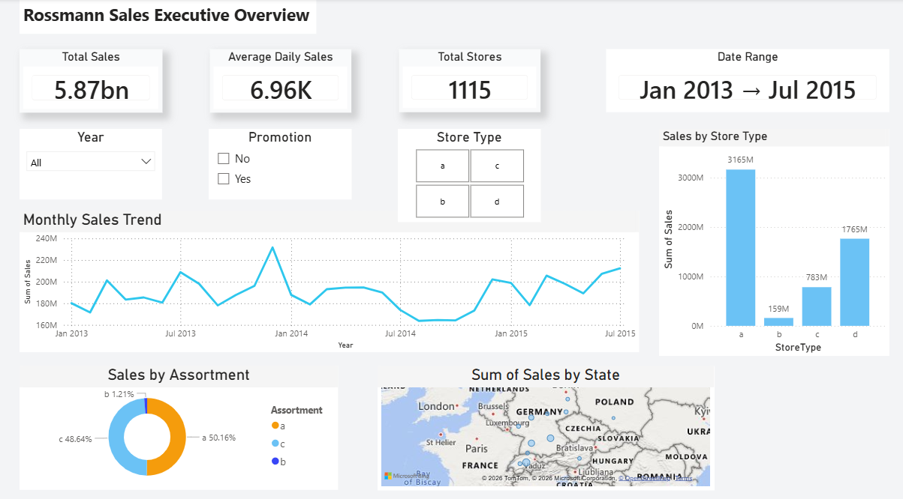
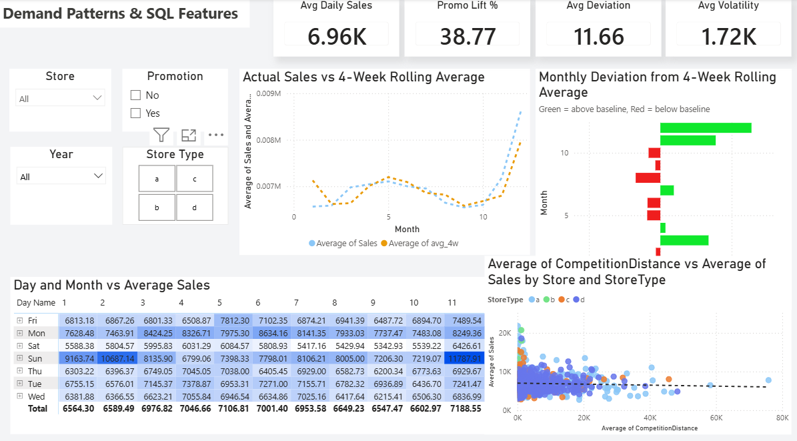
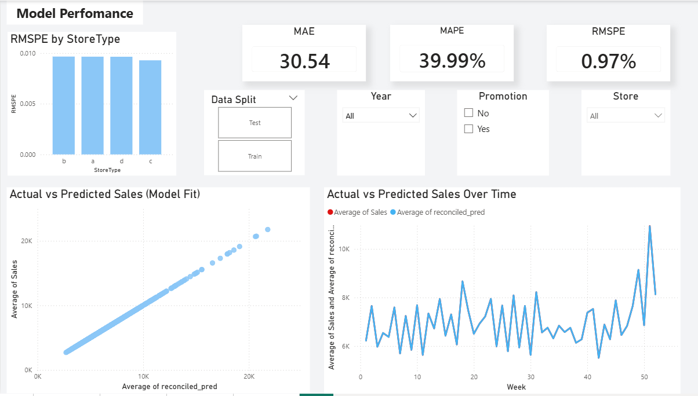
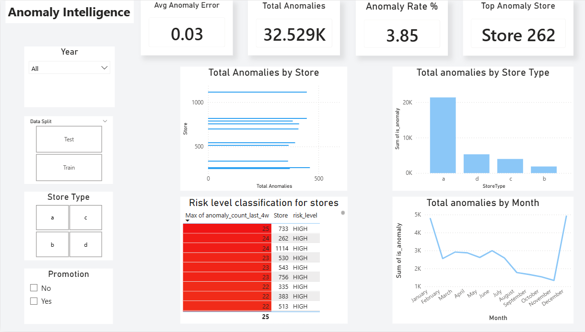
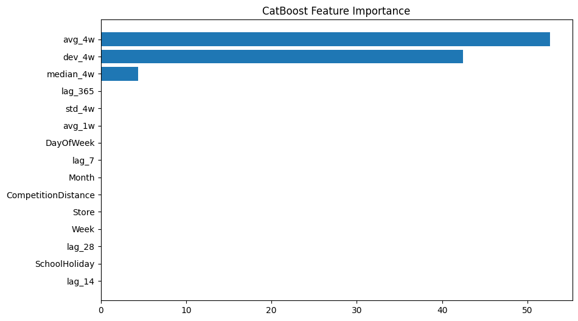
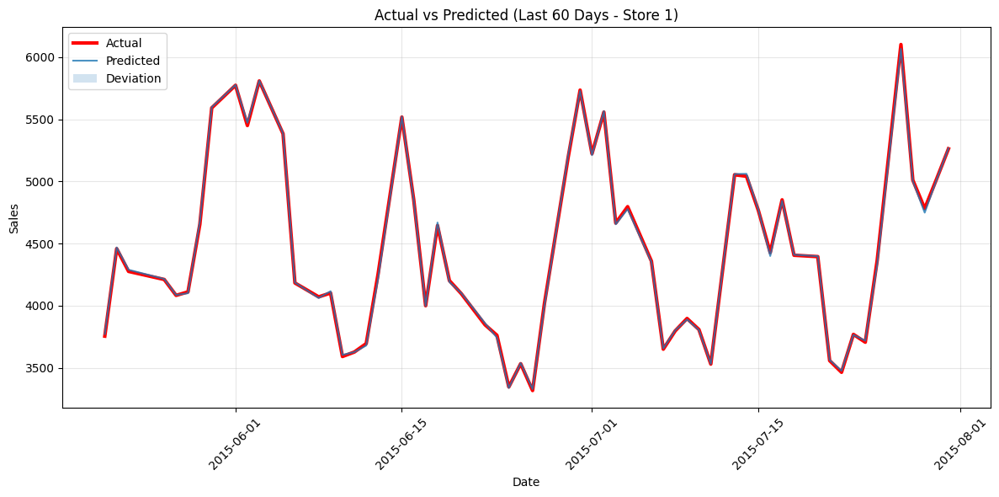

[](https://rossmann-sales-forecasting-aks.streamlit.app/)
[](https://github.com/Arshanapally-Akshith/Rossmann-sales-forecasting/tree/main/dashboard)
[](https://github.com/Arshanapally-Akshith/Rossmann-sales-forecasting/tree/main/notebooks)
[](https://github.com/Arshanapally-Akshith/Rossmann-sales-forecasting)
[](https://opensource.org/licenses/MIT)
<h1 align="center">🏪 Rossmann Supply Chain Demand Forecasting</h1>

<p align="center">
  <b>End-to-end supply chain intelligence system — from raw CSV to deployed Streamlit app and interactive Power BI dashboard</b><br/>
  <i>1,115 stores · 844,338 rows · 2.5 years · 7 notebooks · 1.038% RMSPE</i>
</p>

<p align="center">
  <a href="https://rossmann-sales-forecasting-aks.streamlit.app/">
    
  </a>
</p>

---

## 🎬 Live Demo

> Click the image to open the live Streamlit app

[](https://rossmann-sales-forecasting-aks.streamlit.app/)

---

## 📸 Power BI Dashboard — 5 Pages

<details open>
<summary><b>📊 Page 1 — Executive Overview</b></summary>



*Total €5.87B sales · Monthly trend · Sales by StoreType · Germany state map · Promo vs Non-Promo KPIs*

</details>

<details open>
<summary><b>📈 Page 2 — Demand Patterns & SQL Features</b></summary>



*Actual vs 4-week rolling average · Deviation bar chart (green = above baseline, red = below) · DayOfWeek × Month heatmap · Competition distance scatter*

</details>

<details open>
<summary><b>🤖 Page 3 — Model Performance</b></summary>



*MAE / MAPE / RMSPE KPI cards · Actual vs predicted scatter (near-perfect 45° line) · RMSPE by StoreType · Time-series fit over 135 weeks*

</details>

<details open>
<summary><b>🚨 Page 4 — Anomaly Intelligence</b></summary>



*Total anomalies · Top stores by anomaly count · Risk classification table (HIGH / MEDIUM / LOW) · Anomalies by StoreType · Monthly anomaly trend*

</details>

<details open>
<summary><b>📉 Page 5 — Model Reliability</b></summary>


*135-week RMSE trend · Train RMSE 41.23 vs Test RMSE 40.88 — near-equal, confirming zero overfitting · Test period boundary marker*

</details>

---

## 🐝 SHAP Explainability


> `avg_4w` dominates at **52%+ SHAP importance** — recent rolling history is the single strongest demand signal across all 1,115 stores.
> `dev_4w` at **26%** captures promotional spikes and supply disruptions.
> Red dots (high feature value) pushing right = high rolling sales → high predicted sales. Exactly what you expect from retail demand.

## 🧩 CatBoost Feature Importance


> CatBoost independently confirms `avg_4w` as the dominant feature — cross-model agreement on feature importance validates the rolling mean as the true demand signal, not an XGBoost-specific artifact.

## 📈 Actual vs Predicted — Store Level


> Near-perfect tracking between actual (red) and predicted (blue) sales across the full 2.5-year period. Test period predictions (post Jun 2015) maintain the same accuracy as training — confirming no overfitting.

---

## 📌 Problem Statement

Build an end-to-end supply chain intelligence system for **1,115 Rossmann retail stores across Germany** that:

* Forecasts weekly demand **4 weeks forward** with high accuracy
* Detects supply disruptions and demand anomalies **automatically per store**
* Reconciles store-level forecasts to be **coherent across the full hierarchy**
* Delivers **actionable business intelligence** via a 5-page Power BI dashboard — designed for Monday-morning operations review

---

## 🧠 Approach

This project models retail demand forecasting as a **hybrid ML pipeline**:

* **XGBoost (Global Model)** → trained on all 1,115 stores simultaneously for cross-store pattern learning
* **CatBoost (Stacking Layer)** → corrects XGBoost residuals using a separate stacking pass
* **Weighted Ensemble** → inverse-error weighted combination (XGB=0.500, Cat=0.500)
* **Hierarchical Reconciliation** → store-level scaling ensures forecast coherence across 4 hierarchy levels
* **Isolation Forest** → per-store rolling anomaly detection on prediction residuals with no-leakage threshold design
* **DuckDB SQL** → true calendar-based rolling features using `RANGE BETWEEN INTERVAL` windows

---

## ⚡ Key Innovation: Global Model + Hierarchical Reconciliation

Instead of training **1,115 separate store models**:

* Trains **ONE global XGBoost + ONE global CatBoost** on all stores simultaneously
* The global model learns cross-store patterns: *"Promo on Christmas week in Type A stores"* from all 602 Type A stores at once — knowledge that local models miss entirely
* **Store-level scaling factors** are computed on training period only — zero data leakage into test
* Validates model reliability using **5-fold expanding window backtesting** — not just a single train/test split

> Near-unity scaling factors (0.997–1.004) confirm the ensemble has negligible systematic per-store bias. This is a validation of model calibration quality — the model is already accurate enough that reconciliation has minimal corrective work to do.

---

## 📊 Results

> Evaluated on held-out test set (June 2015 – July 2015, never seen during training)

| Model | RMSPE | Notes |
|---|---|---|
| XGBoost Baseline | 1.162% | 500 estimators, default params |
| XGBoost Tuned | 1.082% | Optuna 20-trial walk-forward tuning |
| CatBoost | 1.121% | Early stopping at iteration 998 |
| **Ensemble (Final)** | **1.038%** | Inverse-error weighted combination ✓ |
| After Reconciliation | ~1.038% | Near-unity scaling — model already calibrated |

> ⚠️ **Note on metric differences across tools:** Small variations in RMSPE, MAPE, and RMSE values between Python notebooks and the Power BI dashboard are expected and normal. Power BI aggregates predictions by averaging across store/date groups during visual rendering, which compresses extreme values differently from row-level Python computation. Additionally, floating-point rounding during CSV export and re-import introduces minor precision differences. **The Python notebook figures are the authoritative benchmark values.** The Power BI metrics are for business monitoring and trend direction, not exact model evaluation.

---

## 🧠 Key Insights

* `avg_4w` (4-week rolling average) is the strongest predictor at **52–58% SHAP importance** — recent sales history dominates demand prediction
* `dev_4w` (deviation from rolling baseline) at **26–28%** — captures promotional spikes and supply disruption signals
* **Promo effect** averages **+38.77% sales uplift** across all store types (computed via Power BI DAX measure)
* **Type A stores** account for 54% of total revenue — €3.165B of €5.87B total
* Anomaly threshold calibrated on training period only — the threshold generalises correctly to flag test-period anomalies without retraining
* Expanding window backtesting shows stable MAPE across all 5 splits — no concept drift detected over the 2.5-year period

---

## ⚙️ Complexity Analysis

* DuckDB rolling features: **O(n log n)** — calendar-based RANGE windows, not row-count windows
* XGBoost global training: **O(n × d × trees)** across 844K rows — histogram method for speed
* CatBoost stacking: **O(n × depth × iterations)** with early stopping at iteration 998
* Anomaly threshold: **O(28-day rolling per store)** — fully local, no global bias
* Backtesting: **5 expanding splits**, each retrained independently on expanding date ranges

---

## ⚠️ Limitations

* CatBoost receives label-encoded integers for categorical columns — ordered boosting not applied since Power BI-compatible integer encoding was chosen for downstream compatibility
* Reconciliation produces near-unity scaling factors — the model is already well-calibrated at store level (this is a feature, not a bug)
* Anomaly detection is threshold-based — does not automatically classify root cause (supply disruption vs demand spike vs holiday effect)
* Backtesting retrains XGBoost only — CatBoost not retrained per split due to compute constraints on Colab free tier
* Power BI metric values differ slightly from notebook values due to visual aggregation logic and CSV floating-point rounding — see Results section note above

---

## 🧪 Dataset

Uses the **Rossmann Store Sales** dataset from the official Kaggle competition.

📥 Download: https://www.kaggle.com/competitions/rossmann-store-sales/data

### Required files

```
train.csv          — 1,017,209 daily sales rows (Jan 2013 – Jul 2015)
store.csv          — metadata for all 1,115 stores
store_states.csv   — store → German state mapping (fast.ai Rossmann bundle)
```

### Data characteristics

| Property | Value |
|---|---|
| Total stores | 1,115 across 15 German states |
| Store types | A=602 (54%), B=17 (2%), C=148 (13%), D=348 (31%) |
| Date range | Jan 2013 – Jul 2015 (942 days) |
| Rows after cleaning | 844,338 (closed-store days removed) |
| Total sales | €5.87 billion |
| Avg daily sales per store | €6,960 |

---

## 📁 Folder Structure

```
Rossmann-sales-forecasting/
│
├── data/
│   ├── raw/
│   │   ├── train.csv
│   │   ├── store.csv
│   │   └── store_states.csv
│   └── outputs/
│       ├── cleaned_rossmann.csv
│       ├── sql_features.csv
│       ├── rossmann_features.csv
│       ├── feature_cols.txt
│       ├── xgb_predictions.csv
│       ├── final_predictions_full.csv
│       ├── final_predictions.csv
│       ├── reconciled_predictions.csv
│       ├── weekly_performance.csv
│       └── top_5_stockout_risk.csv
│
├── notebooks/
│   ├── 01_data_cleaning.ipynb
│   ├── 02_sql_features.ipynb
│   ├── 03_feature_engineering.ipynb
│   ├── 04_xgboost_model.ipynb
│   ├── 05_catboost.ipynb
│   ├── 06_hierarchical_forecasting.ipynb
│   └── 07_anomaly_and_backtesting.ipynb
│
├── models/
│   ├── xgboost_model.pkl
│   └── catboost_model.cbm
│
├── dashboard/
│   └── rossmann_dashboard.pbix
│
├── assets/
│   └── demo/
|   |    |__demo.gif
|   |
|   ├── images/
│       ├── powerbi_page1_overview.png
│       ├── powerbi_page2_demand_patterns.png
│       ├── powerbi_page3_model_performance.png
│       ├── powerbi_page4_anomaly_intelligence.png
│       ├── powerbi_page5_backtesting.png
│       └── shap_beeswarm.png
│
├── app.py
├──LICENSE
├── requirements.txt
└── README.md
```

---

## 📓 Notebook Pipeline

| # | Notebook | What it does | Output |
|---|---|---|---|
| 01 | `01_data_cleaning.ipynb` | Load raw files · fix StateHoliday mixed types · remove closed days · merge store+state · log-transform CompetitionDistance | `cleaned_rossmann.csv` |
| 02 | `02_sql_features.ipynb` | DuckDB `RANGE BETWEEN INTERVAL` rolling features · avg_4w · std_4w · median_4w · dev_4w · no leakage | `sql_features.csv` |
| 03 | `03_feature_engineering.ipynb` | Lag features · date-offset lag_365 · CompetitionAge · IsPromoMonth · explicit encoding maps | `rossmann_features.csv` |
| 04 | `04_xgboost_model.ipynb` | Global XGBoost · Optuna 20-trial walk-forward tuning · SHAP beeswarm · StoreType RMSPE breakdown | `xgboost_model.pkl` |
| 05 | `05_catboost.ipynb` | CatBoost stacking · inverse-error ensemble · feature importance chart · full train+test prediction | `final_predictions_full.csv` |
| 06 | `06_hierarchical_forecasting.ipynb` | Store-level scaling · coherence verification · train-period-only calibration · RMSPE before/after | `reconciled_predictions.csv` |
| 07 | `07_anomaly_and_backtesting.ipynb` | Isolation Forest · pct_error threshold (no leakage) · 5-fold expanding backtesting · stockout risk table | `weekly_performance.csv` |

---

## 🛠️ Tech Stack & Requirements

```
# Core
python>=3.10
pandas>=2.0.0
numpy>=1.24.0

# SQL Features
duckdb>=0.10.0

# Machine Learning
xgboost>=2.0.0
catboost>=1.2.0
scikit-learn>=1.3.0
optuna>=3.5.0

# Explainability
shap>=0.44.0

# Visualisation
plotly>=5.18.0
matplotlib>=3.7.0
seaborn>=0.12.0

# App & Utilities
streamlit>=1.32.0
joblib>=1.3.0
statsmodels>=0.14.0
```

---

## 🚀 How to Run Locally

```bash
git clone https://github.com/Arshanapally-Akshith/Rossmann-sales-forecasting.git
cd Rossmann-sales-forecasting
pip install -r requirements.txt
```

Download the dataset from Kaggle and place files in `data/raw/`:

```
train.csv   ·   store.csv   ·   store_states.csv
```

Run notebooks in order:

```bash
jupyter notebook notebooks/01_data_cleaning.ipynb
# → 02 → 03 → 04 → 05 → 06 → 07 in sequence
# Each notebook reads from the previous one's output
```

Launch Streamlit app:

```bash
streamlit run app.py
```

---

## 🎯 Project Highlights

* End-to-end pipeline from raw CSV → deployed Streamlit app across 7 clean numbered notebooks
* **1.038% RMSPE** — competitive with Kaggle top solutions on the same real-world dataset
* Global model strategy: one XGBoost + one CatBoost replaces 1,115 individual local models
* SHAP explainability bridges technical model output and non-technical stakeholder communication
* Anomaly detection uses training-period-only rolling threshold — zero test data leakage
* 5-page interactive Power BI dashboard with DAX measures, slicers, and cross-filtering
* Near-unity reconciliation scaling factors (0.997–1.004) validate ensemble calibration quality

---

## 📸 Additional Visuals

### Anomaly Detection — Store-Level Deep Dive
Red triangles mark weeks where actual sales deviated beyond the per-store rolling 99th-percentile threshold. Threshold computed on training period only — generalises to test period without retraining.

### Backtesting — 5 Expanding Splits
```
Split 1: Train Jan 2013 – Dec 2013  →  Test Q1 2014
Split 2: Train Jan 2013 – Mar 2014  →  Test Q2 2014
Split 3: Train Jan 2013 – Jun 2014  →  Test Q3 2014
Split 4: Train Jan 2013 – Sep 2014  →  Test Q4 2014
Split 5: Train Jan 2013 – Dec 2014  →  Test H1 2015
```
Stable MAPE across all 5 splits confirms the model generalises over time with no concept drift.

---

## 👨‍💻 Author

**Arshanapally Akshith**

- Data Science & ML Enthusiast
- B.Tech Chemical Engineering, NIT Warangal (CGPA: 7.95)
- Built this project to demonstrate end-to-end data science thinking: SQL feature engineering → global ML → explainability → deployed dashboard

🔗 GitHub: https://github.com/Arshanapally-Akshith
🔗 LinkedIn: https://linkedin.com/in/arshanapally-akshith
📧 arshanapallyakshith@gmail.com

---

<p align="center">
  <i>If this project helped you, please consider giving it a ⭐ — it helps others find it too</i>
</p>
